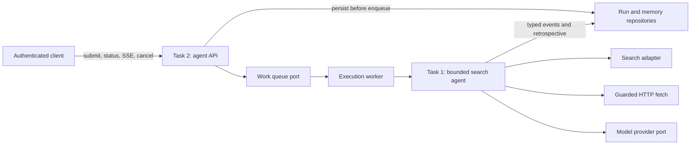
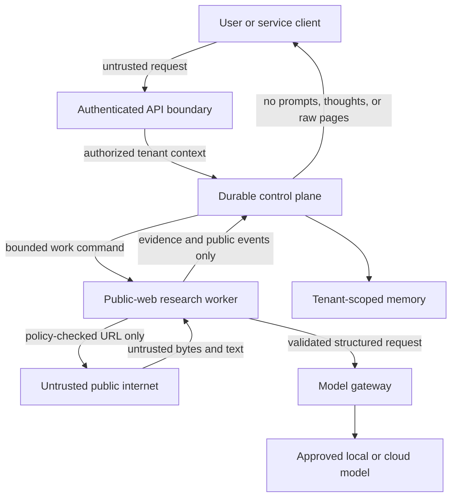
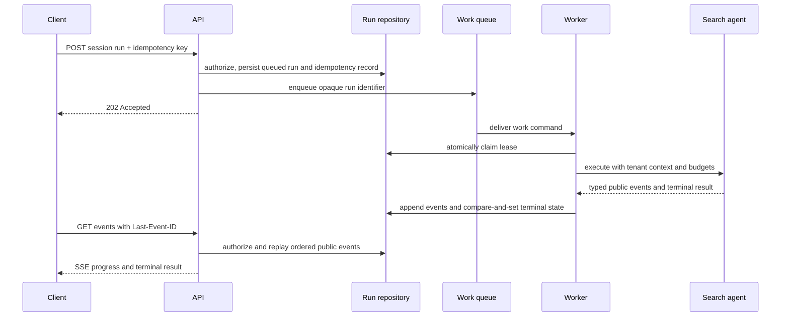

# Platform architecture

## Scope

Tasks 1 to 3 form one research platform with three reviewable boundaries:

1. Task 1 owns bounded research, evidence validation, citations, and episodic memory.
2. Task 2 owns authentication, tenant authorization, durable asynchronous execution,
   public progress events, and resource limits.
3. Task 3 owns packaging, cloud identities, managed adapters, deployment, and
   operations.

Tasks 4 to 6 are independent data-science packages. They share the root toolchain,
not an application framework.

## Component view

The API imports Task 1 contracts through a declared workspace dependency. Task 3
packages the integrated service and supplies cloud implementations of the queue and
repository ports. It does not duplicate orchestration logic.

## Trust and data boundaries

The model, search results, fetched content, request fields, and persisted memory are
untrusted. Deterministic code owns authorization, URL policy, budgets, state
transitions, evidence provenance, citation validation, tenant scope, and memory
promotion. Hidden reasoning is neither persisted nor exposed.

## Runtime profiles

| Concern | Local and CI | Assessment deployment | Enterprise target |
|---|---|---|---|
| Inference | deterministic fake; Ollama is opt-in | fake or approved gateway; cloud GPU off | governed gateway to approved Cloud Run GPU, GKE, Vertex AI, or on-prem backend |
| State | SQLite | Firestore | Spanner when global consistency/topology justify it; AlloyDB/PostgreSQL for a regional relational workload |
| Work dispatch | in-process durable-worker adapter | Cloud Tasks | Pub/Sub event backbone plus Cloud Tasks for destination throttling |
| Compute | local processes | Cloud Run, scale to zero | regional cells using Cloud Run and GKE according to measured placement needs |
| Identity | local development credentials | API keys for clients; workload identity for services and CI | corporate OIDC for users; workload identity and policy-controlled service accounts |

Cloud inference, browser automation, semantic-memory activation, procedural learning,
and a UI are disabled by default. The mandatory test suite uses deterministic fakes
and requires neither a cloud account nor a local language model.

## Core invariants

- A run is persisted before work is dispatched.
- Every repository operation carries tenant context; public identifiers are opaque.
- State transitions are explicit, legal, and terminal exactly once.
- Idempotency, cancellation, retry, and lease behavior are application contracts,
  not properties assumed from a queue vendor.
- Every fetch candidate and redirect is checked immediately before connection.
- Answers can reference only evidence IDs and URLs created by the evidence layer.
- Public events contain typed progress and evidence metadata, never prompts, hidden
  reasoning, raw pages, credentials, or internal exception details.
- Memory records are tenant scoped, provenance aware, expirable, and deletable.
- Runtime secrets are injected by identity-authorized secret references and never
  stored in source, Terraform values, images, or CI credentials.

## Primary request sequence

SSE is a replayable convenience channel over durable events. A dropped connection
does not change execution, and reconnect authorization is checked again.

## Failure model

All external operations have explicit time, count, and size budgets. Safe idempotent
operations may retry a bounded number of times; state mutations use idempotency or
compare-and-set semantics. Exhausted budgets, unsafe URLs, missing evidence, model
schema failures, cancellation, and dependency outages produce typed terminal or
recoverable states. They do not fall through to an unbounded agent loop.

## Decision records

- [ADR-0001: explicit agent state machine](adr/0001-explicit-agent-state-machine.md)
- [ADR-0002: persistence profiles](adr/0002-persistence-profiles.md)
- [ADR-0003: application-managed memory](adr/0003-application-managed-memory.md)
- [ADR-0004: evidence-based local model selection](adr/0004-local-model-selection.md)
- [ADR-0005: GCP assessment and enterprise deployment](adr/0005-gcp-deployment-profiles.md)

