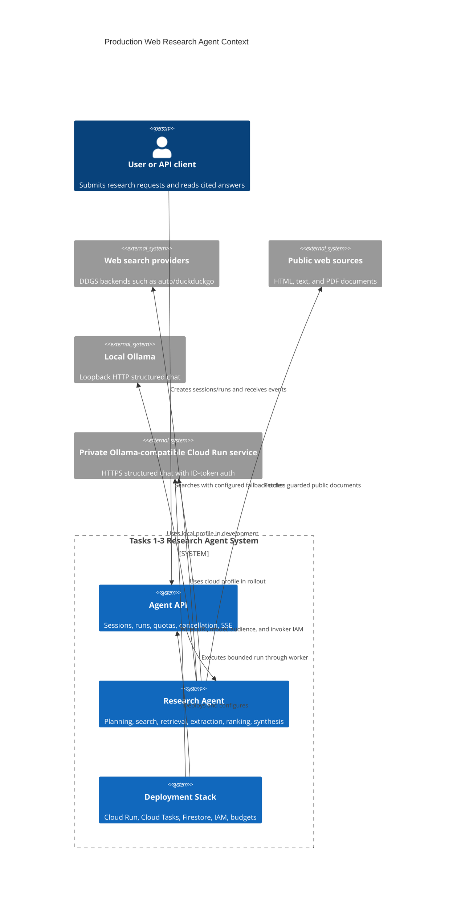
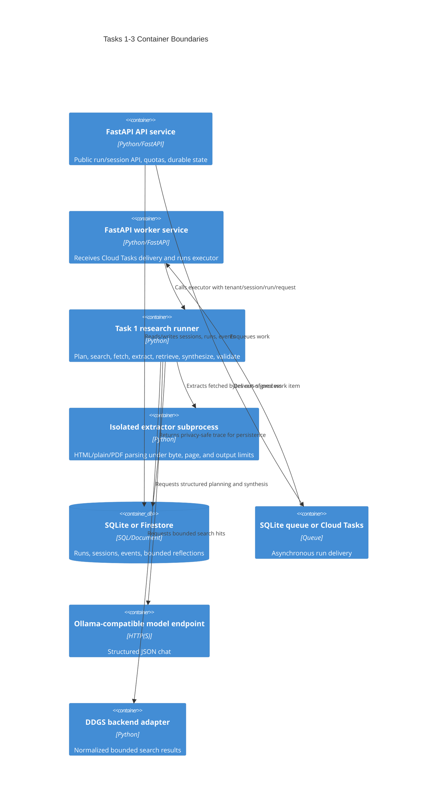
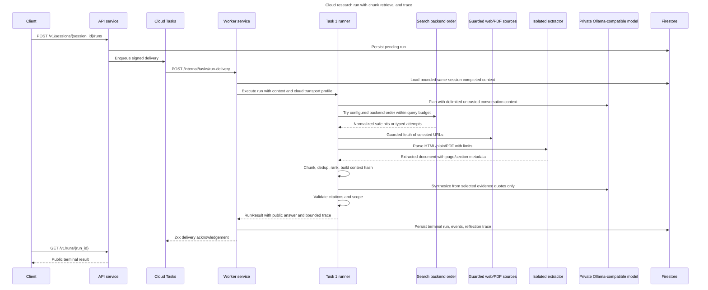

# Production web-research remediation implementation plan

## Objective

Make Task 1 a genuinely usable, bounded research agent in both local and cloud
deployments, while preserving the existing safety contracts. Close the four confirmed
gaps (cloud wiring, PDF support, search resilience, and conversational context), add
privacy-safe action logging, and implement the smallest high-value production slice
from `docs/production-web-research-gap-remediation.md`.

This plan deliberately does not add embeddings, a browser farm, or multi-layer caches
without measurements. The frozen end-to-end evaluation added here will provide the
evidence required to justify those later extensions.

## Evidence and decisions

- The current public evidence summary is limited to the first 400 characters, so a
  fact later in a long report never reaches synthesis.
- Static retrieval accepts only HTML, XHTML, and plain text. Siemens sustainability
  and financial reports are commonly PDF documents.
- The installed `ddgs` API defaults to the `auto` metasearch backend. Its own current
  documentation recommends explicit backend fallback after typed failures. The
  repository instead defaults to `duckduckgo`, which failed the live Siemens smoke
  query while `auto` returned useful sources.
- `pypdf` supports page-level text extraction and a layout mode, but page content
  streams can expand dramatically. PDF parsing therefore stays in the existing
  isolated extraction process and receives page, input-byte, output-character, and
  content-stream limits.
- An Ollama-compatible server is not inherently local. A private HTTPS Cloud Run GPU
  service can expose the same API. Cloud mode differs through transport, workload
  identity, audience, infrastructure composition, and configuration—not through a
  different agent implementation.
- Conversation history is durable in Task 2, but is not supplied to Task 1 planning.
  Only bounded, completed, same-tenant/same-session turns may cross that boundary.
- Detailed logging must be reconstructable without storing raw pages, prompts,
  credentials, hidden reasoning, tenant IDs, or unbounded query/domain labels.

## Architecture assumptions

- This is an assessment repository operated by one developer, but Tasks 1 to 3 must
  read as a small production system that a Siemens team could roll forward.
- Local execution must stay cheap and deterministic: fake inference remains the
  default for submission checks, and local Ollama uses loopback HTTP only.
- Cloud execution may use an Ollama-compatible model server, including Ollama or a
  compatible gateway running on private Cloud Run GPU infrastructure.
- Cloud rollout means an explicit runtime profile and Terraform wiring, not merely
  accepting an arbitrary remote URL.
- The API contract remains stable. New trace/logging details are internal and
  privacy-safe; public failures remain coarse unless a test already asserts a more
  specific public value.
- The remediation targets the highest-value slice from
  `docs/production-web-research-gap-remediation.md`; browser fallback, OCR,
  embeddings, caches, and enterprise SIEM/DLP remain documented extensions.

## ADR: Keep one agent with explicit local and cloud transport profiles

### Status: Proposed

### Context

Task 1 already composes one Ollama-backed research executor. The gap is that cloud
deployment still runs the worker in fake mode and does not pass model-plane URI,
model name, or Google ID-token audience into the worker.

### Options

1. Keep only local Ollama and document cloud as future work. This is simplest, but
   does not satisfy the two-mode rollout requirement.
2. Fork a separate cloud agent implementation. This makes cloud settings obvious, but
   doubles policy, retrieval, and evaluation behavior.
3. Keep one agent and make transport profile explicit. Local uses loopback HTTP;
   cloud uses HTTPS plus ID-token auth and Terraform-wired private model endpoint.

### Decision

Choose option 3 because it proves local/cloud parity while changing the smallest
runtime surface.

### Consequences

- Makes easier: one evaluation suite covers both modes; Task 1 behavior does not fork.
- Makes harder: startup validation must reject partial cloud wiring early.
- Revisit if: Siemens requires a managed non-Ollama model API with a materially
  different request/response contract.

## ADR: Add bounded PDF extraction inside the existing isolated extractor process

### Status: Proposed

### Context

The production gap document calls out PDF reports as a core research source. Context7
for `pypdf` confirms page-level text extraction and layout mode, but also warns that
large content streams can consume extreme memory if parsed unchecked.

### Options

1. Parse PDFs in the runner process. It is easy to wire, but risks blocking or
   exhausting the event loop.
2. Add a full browser/OCR service now. It covers more formats, but adds operational
   burden before the basic PDF path is proven.
3. Extend the existing subprocess extractor with `pypdf`, page/content/output limits,
   and typed errors.

### Decision

Choose option 3 because it preserves the current cancellation and isolation boundary.

### Consequences

- Makes easier: malformed/oversized PDFs fail safely without raw bytes in logs.
- Makes harder: scanned PDFs without text still require a future OCR extension.
- Revisit if: frozen evaluation shows high scanned-PDF failure rates.

## ADR: Replace first-page summary context with deterministic top-k chunks

### Status: Proposed

### Context

The current evidence summary sends only the first 400 normalized characters to
synthesis, so long Siemens reports can be fetched successfully while the requested
fact never reaches the model.

### Options

1. Increase the summary size. It is quick, but wastes token budget and still ignores
   relevance.
2. Add embeddings immediately. This may improve semantic recall, but adds new model
   cost, cache needs, and nondeterminism.
3. Add structural chunking with lexical/authority/freshness scoring, exact dedup,
   and top-k context quotes.

### Decision

Choose option 3 because it is deterministic, testable, and enough to prove late-page
PDF/table recall before adding semantic infrastructure.

### Consequences

- Makes easier: frozen corpus can assert exact selected chunks and citations.
- Makes harder: semantic paraphrase recall is limited until embeddings are justified.
- Revisit if: lexical chunk recall@k misses confirmed answer-bearing passages.

## ADR: Persist privacy-safe action traces, not raw research artifacts

### Status: Proposed

### Context

The user asked for detailed logging of all system actions. The remediation document
also requires operators to reconstruct source/chunk choices without storing raw
pages, prompts, hidden reasoning, credentials, or high-cardinality labels.

### Options

1. Log raw prompts, responses, pages, and exception strings. This is easy to debug,
   but violates privacy and prompt-injection boundaries.
2. Persist only aggregate usage. This is safe, but insufficient for production
   diagnosis.
3. Add bounded action records with stage, outcome, safe IDs, counts, durations,
   reason codes, context hash, and usage deltas; emit matching structured logs.

### Decision

Choose option 3 because it is diagnosable while staying compatible with the existing
reflection storage boundary.

### Consequences

- Makes easier: operators can distinguish search, fetch, extraction, retrieval,
  generation, and verification failures.
- Makes harder: trace schema needs strict bounds and compatibility tests.
- Revisit if: the 64 KiB reflection budget is exceeded by realistic run traces.

## C4 Context



## C4 Container



## Critical Sequence: Cloud Research Run



## Contracts to implement before worker fan-out

### Data contracts

- `ResearchDocument`: deterministic `document_id`, canonical URL, title, media type,
  source type, content hash, optional published/updated dates, retrieved timestamp,
  and bounded normalized text.
- `ResearchChunk`: deterministic `chunk_id`, parent `document_id`, URL, title,
  page/section/table metadata, source type, hash, bounded text, and ranking features.
- `SelectedContext`: ordered chunk IDs, bounded quote strings, total character count,
  score components, and `context_hash`.
- `ConversationTurn`: previous completed user request and public answer only, capped
  by turn count and per-field length, scoped to identical tenant and session.
- `ActionTraceRecord`: stage, action, outcome, monotonic duration, provider/format,
  counts, safe IDs, bounded reason code, usage delta, and optional context hash.
  Max 128 records per run; overflow collapses into a single `trace.truncated` record.
  Persisted reflection plus trace summary must remain below the existing 64 KiB
  serialized boundary.

### Runtime/env contracts

- `AGENT_API_INFERENCE_MODE`: `fake`, `disabled`, or `ollama`.
- `AGENT_MODEL_TRANSPORT_PROFILE`: `local` or `cloud` when inference is `ollama`.
- `local`: requires clean loopback `http://127.0.0.1:11434` or `localhost` origin and
  forbids Google ID-token audience.
- `cloud`: requires clean HTTPS `AGENT_MODEL_BASE_URL`, exact matching
  `AGENT_MODEL_GOOGLE_ID_TOKEN_AUDIENCE`, and worker service-account invoker IAM on
  the model service.
- `AGENT_SEARCH_BACKENDS`: ordered comma-separated ASCII allow-list, defaulting to
  `auto`, with optional `duckduckgo` fallback for deterministic tests.
- `AGENT_ACTION_LOG_LEVEL`: bounded logging verbosity selector; logging failure is
  non-fatal.

### Module boundaries

- Task 1 retrieval modules may depend on Task 1 contracts/tools only.
- Task 1 must not import Task 2 storage or Task 3 deployment modules.
- Task 2 may adapt repository state into `ConversationTurn` and persist trace data,
  but must not implement search, PDF parsing, ranking, or citation logic.
- Task 3 may pass runtime configuration and IAM/Terraform outputs, but must not
  duplicate Task 1 runtime validation rules beyond Terraform variable validation.

## Scope implemented now

## Review amendments (implementation blockers resolved)

- Retrieval contracts are frozen before integration: S1 owns pure extraction,
  `ResearchDocument`, `ResearchChunk`, and `SelectedContext` code; S3/root alone owns
  the `ResearchRunner` path from selected chunks to evidence quotes and synthesis.
- Conversation history is a separate Task 2 port, not reviewed semantic/procedural
  memory. Container composition must construct SQLite/Firestore repositories before
  wrapping an Ollama executor with same-session context loading.
- Context-aware planning validation may use bounded topic aliases from delimited prior
  turns, but history cannot change policy, tools, budgets, or evidence requirements.
- Live actions flow through a failure-isolated `ResearchTraceSink`. `RunResult.trace`
  defaults to `()` for fixture compatibility. Reflections read v1 and write v2 with a
  bounded trace summary and verified final citation claims below 64 KiB.
- The cloud deliverable includes creation of the absent
  `terraform/environments/production` root, which composes managed services, ingress,
  model plane, and run services end to end.
- At most three workers run beside root. Wave 1 is S1/S2/S4; S3 starts after S1
  publishes the retrieval interface.
- The PDF dependency is pinned to `pypdf>=6,<7`; `uv.lock` is regenerated once and
  subprocess extraction is tested through `AsyncLocalExtractor`.
- Ignored local `* 2.tf`/`* 2.hcl` Finder duplicates are never deleted or edited.
  Terraform checks run from a temporary clean `git archive` to prove clean-clone
  behavior.

### P0 — retrieval correctness

1. Introduce immutable internal document/chunk contracts with deterministic IDs,
   source URL, title, content hash, format, page/section provenance, source type,
   publication/update/retrieval timestamps, and bounded text.
2. Add isolated PDF extraction using `pypdf`, page provenance, layout-preserving text,
   conservative table-block preservation, encrypted/oversized/malformed typed errors,
   and the existing subprocess timeout/output limits.
3. Preserve HTML table headers and rows in extracted text instead of silently dropping
   tables.
4. Structurally chunk HTML/plain/PDF output, deduplicate identical content, classify
   source authority, derive best-effort temporal metadata, lexically score chunks with
   exact-term and authority/freshness components, and select deterministic top-k
   context under a hard character/token budget.
5. Build evidence quotes from selected chunks so synthesis receives relevant passages
   rather than the first 400 source characters. Retain the existing evidence-ID/URL
   validation as the final guard.
6. Add a frozen pipeline corpus covering a late-document fact, PDF page/table
   provenance, duplicate content, authority ordering, malformed PDFs, and provider
   fallback.

### P0/P1 — search resilience

1. Change the production default from `duckduckgo` to `auto`.
2. Add a bounded ordered fallback adapter. A provider failure or empty result advances
   to the next configured backend; invalid rows remain rejected by the existing site
   policy.
3. Expose backend order in the CLI and container environment, validate it against a
   small ASCII allow-list grammar, and preserve strict maximum-result/query budgets.
4. Log backend attempt, normalized hit count, rejection count, duration, and bounded
   reason code—never raw query text or backend exception text.

### P1 — conversational context

1. Define a strict `ConversationTurn` contract containing only prior completed user
   request and public answer, with per-field and turn-count bounds.
2. Let Task 1 planning and no-search/direct-reply synthesis consume the bounded context
   as explicitly delimited untrusted data.
3. Add a Task 2 executor decorator that loads only prior completed runs for the same
   tenant/session, excludes the current run, preserves chronological order, and calls
   Task 1 with at most the configured recent turns.
4. Construct repositories before executor decoration and use the same decorator for
   local SQLite and cloud Firestore repositories so context behavior does not depend
   on the deployment mode.
5. Confirm that cross-tenant, failed, cancelled, current, and prompt-injection-shaped
   turns cannot influence the plan.

### P1 — typed trace and detailed action logging

1. Expand internal failure stages to planning, search, fetch, extraction, retrieval,
   generation, citation, verification, budget, and cancellation while keeping public
   responses coarse and safe.
2. Add a failure-isolated `ResearchTraceSink` and bounded immutable stage/action
   records to `RunResult` (default empty): stage, action, outcome, monotonic duration,
   provider/format, item counts, selected document/chunk IDs, reason code, usage delta,
   and context hash. Do not include raw content or exception messages.
3. Emit each action as one structured JSON log with pseudonymized run/session/tenant
   identifiers and bounded fields. Make logging failure non-fatal.
4. Persist a bounded privacy-safe trace summary through reflection storage, keep v1
   reads compatible, write v2, and enforce the existing 64 KiB boundary.
5. Cover run creation, planning, every search attempt, hit normalization, fetch,
   extraction, chunk/dedup/rank/context selection, memory/context reads, generation,
   validation, completion/failure, worker claim/lease, and model transport mode.

### P0 — local and cloud runtime modes

1. Keep one `ollama` inference engine and make the transport profile explicit:
   `local` uses a loopback HTTP Ollama endpoint without cloud credentials; `cloud`
   requires HTTPS, a matching Google ID-token audience, and a private model endpoint.
2. Validate impossible or unsafe combinations at startup.
3. Pass model URL, model name, audience, search backend order, logging level, and
   transport profile into the Cloud Run worker.
4. Compose production execution plane and private Cloud Run GPU model plane in one
   Terraform root, wiring `module.model_plane.model_plane.service_uri` and model name
   directly into `module.run_services`; grant only the worker identity invocation.
5. Keep assessment/dev fake mode as a cost-free smoke option, and document/test both
   modes without requiring a paid deployment.

## Explicit follow-up extensions (not enabled without evaluation evidence)

- OCR for scanned PDFs and a controlled browser sidecar for JavaScript-only pages.
- Semantic embeddings/reranking after lexical source/chunk recall is measured.
- Bounded adaptive second-pass research, parallel fetch/provider fan-out, and circuit
  breakers after latency and provider-failure baselines exist.
- Versioned search/document/chunk caches with query-class freshness TTLs.
- Per-run monetary attribution once provider/model prices are configured.
- Corporate DLP, SIEM export, regional failover, deletion drills, and production load
  certification; these require Siemens environment and policy inputs, not code-only
  assumptions.

## Implementation sprints

### Sprint 0 — lock contracts and regression cases

- Add failing unit/e2e tests for the four confirmed gaps and the selected remediation
  gates.
- Record existing API/output compatibility constraints.
- Acceptance: tests fail only because the new behavior is absent; existing fixed eval
  still passes.

### Sprint 1 — documents, chunks, and selection

- Add `documents.py` internal models and deterministic helpers.
- Extend fetch content types for `application/pdf` without weakening URL/byte guards.
- Extend isolated extraction for PDF and tables.
- Add deterministic chunking/dedup/ranking/context selection.
- Connect selected passages to evidence quotes and synthesis.
- Acceptance: a fact near the end of a frozen Siemens-like PDF is selected and cited;
  table headers/units/page survive; malformed/oversized documents fail safely.

### Sprint 2 — search resilience and runtime configuration

- Add ordered backend fallback and default `auto`.
- Expose CLI/env configuration and structured attempt logs.
- Acceptance: simulated DuckDuckGo failure falls back once, respects budgets, and
  returns normalized safe results; CLI and container use the configured order.

### Sprint 3 — conversation and research trace

- Add bounded turn contract and context-aware planning.
- Add repository-backed executor decorator for both SQLite and Firestore.
- Add action trace to Task 1 and persistence/log emission in Task 2.
- Acceptance: a follow-up resolves using prior completed context; tenant/session
  isolation holds; trace reconstructs source/chunk selection without raw content.

### Sprint 4 — dual-mode cloud composition

- Add local/cloud model transport profiles and startup validation.
- Parameterize the Cloud Run worker and compose the production root end to end.
- Update examples and operator runbooks.
- Acceptance: Terraform tests prove fake assessment mode and cloud Ollama mode; cloud
  mode receives the exact private service URI as base URL and ID-token audience.
- The new production composition must be created explicitly because the repository
  currently has `dev` and `production-model-plane` roots, not a complete
  `production` root that wires execution plane and model plane together.

### Sprint 5 — integrated verification

- Run format, lint, strict typing, focused tests, frozen end-to-end corpus, all Task 1
  and Task 2 tests, Terraform tests/validation, submission audit, and local container
  smoke.
- Run one adversarial review over the complete task commit range, fix every confirmed
  finding, commit the fixes, then run a second adversarial review and fix/commit its
  confirmed findings as requested.
- Run Terraform validation/tests from a temporary clean `git archive` so ignored local
  duplicate files cannot create false declarations.

## Atomic commit strategy

1. Plans and acceptance matrix.
2. PDF/table extraction plus document/chunk retrieval and tests.
3. Search fallback, CLI/runtime configuration, and tests.
4. Conversation context plus privacy-safe trace/logging and tests.
5. Local/cloud Terraform composition, docs, and tests.
6. First adversarial-review remediations.
7. Second adversarial-review remediations, if any.

The adversarial review gate runs at the end of the complete implementation rather
than after each commit, per the user's explicit instruction.

## Verification commands

```bash
uv run ruff format --check .
uv run ruff check .
uv run mypy task-*/src scripts
uv run pytest task-01-search-agent/tests task-02-agent-api/tests task-03-deployment-strategy/tests
uv run pytest tests/test_submission_audit.py
uv run python task-01-search-agent/evals/run.py
make local-submission
terraform -chdir=task-03-deployment-strategy/terraform/modules/run_services test
terraform -chdir=task-03-deployment-strategy/terraform/environments/dev test
terraform -chdir=task-03-deployment-strategy/terraform/environments/production-model-plane test
terraform -chdir=task-03-deployment-strategy/terraform/environments/production test
```

## Gotchas and safeguards

- Never parse a PDF in the API/worker event loop or outside resource bounds.
- Do not treat PDF metadata as trustworthy; normalize and bound every field.
- Do not use retrieval-time as publication freshness.
- Do not persist raw web content, prompts, model reasoning, credentials, or backend
  exception strings in logs/traces.
- Do not let conversation context count as evidence or override system/tool policy.
- Do not let provider fallback exceed the original query or result budget.
- The model audience must exactly match the clean HTTPS model origin in cloud mode.
- Preserve exact URL and content-hash evidence validation after chunk selection.
- Keep deterministic ordering and IDs so the frozen corpus remains reproducible.
- Treat the existing 64 KiB reflection/storage limit as a hard compatibility gate for
  persisted traces; if a full internal trace would exceed it, persist a bounded trace
  summary and emit detailed per-action JSON logs instead.
- In the production Terraform composition, fail tests if the worker remains in
  `AGENT_API_INFERENCE_MODE=fake` when cloud model-plane wiring is enabled.
