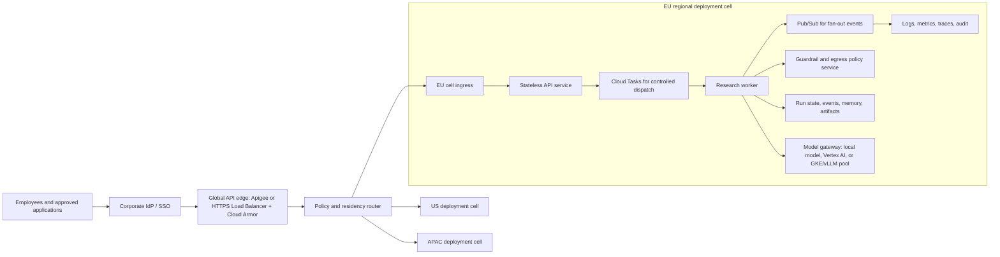

# Task 3: Deployment strategy

## Assignment baseline

Describe how to deploy the Internet-search agent and API to a hyperscaler. The strategy must cover the architecture, scalability, reliability, security, and the services or tools used for orchestration, persistence, and monitoring. The required deliverable is a detailed deployment plan with architecture diagrams where useful.

## Recommended platform and stack

Google Cloud is the working recommendation because its managed serverless, queueing, identity, model-hosting, and observability services map cleanly to the system. The final decision should be checked against model availability, region, cost, and the live-deployment budget.

This strategy deliberately separates two deployment targets:

- Assessment deployment: a low-cost, reproducible environment that proves the architecture without leaving expensive compute running.
- Enterprise target: a production architecture for a large industrial company with global users, strict tenant isolation, regulated data boundaries, and central platform governance.

The same application contracts should work in both targets. The difference is the scale unit, identity perimeter, data tier, ingress tier, observability depth, and operational process.

- Terraform for Infrastructure as Code, with reviewable plans and remote state.
- Cloud Run for the stateless API and orchestration worker.
- Cloud Tasks for bounded asynchronous dispatch in the assessment environment;
  Pub/Sub pull consumers for the enterprise event backbone and fan-out.
- A model-gateway contract with local Ollama for development, GKE-hosted open models
  for company-controlled production inference, and Vertex AI only when its model,
  region, data terms, latency, and cost pass the promotion gates.
- Firestore for assessment state. Production evaluates Spanner for strongly
  consistent regional or multi-region control state and AlloyDB/PostgreSQL for a
  regional relational workload. Semantic memory uses a separate evidence and
  deletion gate before any vector index is introduced.
- Cloud Storage for large research artifacts with lifecycle and retention policies.
- Secret Manager for application secrets and external credentials.
- Artifact Registry for immutable container images.
- External Application Load Balancer or API gateway controls, plus Cloud Armor where the exposed path and threat model justify it.
- Cloud Logging, Monitoring, Trace, Error Reporting, and alerting tied to service-level objectives.
- GitHub Actions with Workload Identity Federation. CI receives no long-lived Google Cloud service-account key.

This design uses managed services and scale-to-demand paths instead of leaving a GPU virtual machine running. A dedicated GPU deployment is acceptable only if measured traffic, latency, and data constraints make the managed endpoint unsuitable.

## Production target for Siemens-wide scale

For a company-wide rollout, the submission architecture becomes the development cell, not the final topology. The production design should use a cell-based architecture: each region or regulated business domain receives an independently scalable deployment cell with the same API contract, policy contract, and memory schema. A global control layer routes users to the right cell, enforces corporate identity, and collects aggregated operational telemetry without moving sensitive research content across residency boundaries.

### Scale assumptions

The production strategy should be sized from measured unit economics rather than a guessed VM count:

- `cost_per_run = API + queue + fetch + extraction + model_tokens + memory_reads + observability`
- `capacity_per_cell = min(API capacity, queue dispatch rate, worker concurrency, model gateway quota, data write throughput, egress policy throughput)`
- `user_experience_slo = p95 submission latency + p95 first event latency + p95 run completion latency by query class`

Do not infer capacity from the company name alone. The design should validate at
least three synthetic envelopes: a pilot, a business unit, and an enterprise stress
case. Those inputs are then replaced with measured active users, submissions per
second, in-flight runs, pages per run, tokens per run, residency, and SLO data. The
system needs per-tenant budgets, queue backpressure, admission control, and graceful
degradation before it needs a fleet of always-on GPUs.

### Enterprise architecture

### What changes from the low-cost assessment deployment

The assessment deployment keeps Cloud Run, Cloud Tasks, Firestore, Secret Manager, Artifact Registry, WIF, and a small budget because it must be runnable and reviewable. Production adds stricter boundaries and alternate components when the measured load or governance model requires them:

- Ingress moves from a direct service/API gateway baseline to Apigee or a global
  HTTPS Load Balancer with Cloud Armor, plus no bypass through the default Cloud Run
  URL. IAP is reserved for internal browser/admin surfaces where its identity proxy
  model fits; application APIs still validate audience-bound corporate tokens.
- Authentication moves from API keys for the take-home API to corporate OIDC/SAML through the enterprise IdP, with service-to-service identity on every internal call.
- A single-region dev project becomes an organization/folder landing zone with organization policies, VPC Service Controls, central logging, environment separation, and policy-as-code.
- Firestore remains valid for the assessment and early pilot. At enterprise scale,
  strongly consistent multi-region or in-country control state should evaluate
  Spanner; a regional relational workload can instead justify AlloyDB/PostgreSQL.
  Large evidence artifacts go to regional Cloud Storage, while redacted analytics
  and SRE reporting go to BigQuery. Hot counters and distributed rate limits can use
  Memorystore only after a measured need.
- Cloud Tasks remains useful for scheduled or per-destination rate-controlled HTTP
  work. Pub/Sub pull consumers become the high-throughput production event backbone
  for orchestration and fan-out. Application idempotency remains mandatory because
  delivery and publisher retries can still create repeated work.
- Cloud Run remains a strong API/control-plane runtime. GKE Autopilot becomes the production worker/model-serving option when the workload needs custom networking, sidecars, service mesh, GPU scheduling, high steady throughput, or a long-running model gateway.
- Local Ollama remains a development and benchmark adapter. Production inference is routed through a model gateway that can select Vertex AI endpoints, GKE-hosted vLLM/TGI, or an approved external model service by tenant, region, sensitivity, latency, and cost.
- The egress guard becomes a governed egress layer: URL policy, SSRF checks, DNS controls, download restrictions, allow/deny categories, private NAT or proxy, and auditable exceptions. Public-web workers run in an isolated egress project with no route to internal or operational-technology networks; ACL-protected internal retrieval uses a separate connector plane.
- Observability expands from smoke metrics to SLO dashboards, distributed tracing, audit log sinks, anomaly alerts, cost-per-run reporting, synthetic probes, incident runbooks, and restore drills.
- Deployment changes from one protected dev environment to promotion through dev, staging, canary, production, and regional cells, using immutable image digests, SBOM/provenance, Binary Authorization where applicable, and progressive rollout.

### Zero-trust production controls

- Workforce access is through the corporate IdP and context-aware access policies, not shared application credentials.
- Workload access uses one service identity per API, worker, queue caller, model gateway, CI job, migration job, and observability exporter.
- Service accounts are granted resource-specific roles only. CI uses Workload Identity Federation and short-lived credentials.
- Sensitive projects use VPC Service Controls, Private Google Access, restricted Google APIs, CMEK where required, and organization policies to prevent public exposure and key creation.
- Every tenant and region has explicit data ownership, retention, deletion, and audit rules. Memory is tenant-scoped, evidence-backed, and deletable.
- All LLM/tool inputs are untrusted. Model output never grants authorization, selects arbitrary URLs, writes long-term memory, or changes runtime policy without deterministic validation.

### Reliability and operations

- Define SLOs separately for API availability, run acceptance latency, event streaming latency, successful completion rate, citation validation rate, and policy-block correctness.
- Use queue depth, queue age, worker saturation, model gateway latency, policy-denial rate, and cost-per-run as autoscaling and alerting signals.
- Each async boundary requires idempotency, retry with jitter, dead-letter handling, cancellation, terminal-state repair, and replay-safe event processing.
- Run multi-region active-active only after the single-region cell has passing load tests and a tested restore path. Production DR must define RTO/RPO, backup cadence, restore drills, and regional evacuation.
- Enterprise rollout uses cell-level canaries. A bad model, prompt, policy, or container revision must be reversible without changing Git history.

## Provider decision

The provider choice is a weighted architecture decision, not a statement that one
hyperscaler is universally superior. Before production commitment, score GCP, Azure,
and AWS against security/data sovereignty, corporate identity and hybrid integration,
open-model and managed inference, global transactional/event services, API/edge
governance, container portability, platform operations, commercial commitments, and
regional availability. The assignment selects GCP as the reference implementation;
enterprise discovery can reverse that choice.

GCP is the recommended implementation cloud for this assignment because it gives the shortest path from a free/low-cost assessment environment to a serious enterprise design without changing the application contract:

- Cloud Run gives fast autoscaling, scale-to-zero by default, revision traffic splitting, authenticated/private service modes, and maximum-instance controls.
- Cloud Tasks gives explicit queue dispatch rate, concurrency, and retry controls for bounded agent runs.
- Workload Identity Federation removes long-lived CI service-account keys and supports GitHub OIDC.
- Firestore gives a serverless state option for the assessment and early pilot.
- Apigee, IAP, Cloud Armor, VPC Service Controls, Organization Policy, Secret Manager, Artifact Registry, Cloud Logging/Monitoring, Vertex AI, and GKE Autopilot form a credible enterprise upgrade path.
- The enterprise foundations blueprint gives a recognized landing-zone pattern that can be implemented with Terraform before workloads are deployed.

GCP's additional production advantage for this design is the combination of GKE for
company-controlled open-model serving, Vertex AI for approved managed inference,
Spanner for strongly consistent regional/dual-region/multi-region control state, and
Pub/Sub for the high-throughput event plane. These services are recommendations with
promotion gates, not dependencies of the low-cost submission.

Azure would become the stronger choice if the organization standardizes on Microsoft Entra ID, Azure API Management, Azure OpenAI, Microsoft Defender/Sentinel, and existing Azure landing zones. AWS would become the stronger choice if the organization already operates a mature AWS foundation and wants to lean into API Gateway, Lambda/ECS/EKS, SQS/EventBridge, DynamoDB, and Bedrock/Knowledge Bases. The architecture should remain portable at the application boundary: provider-specific code lives behind identity, queue, repository, observability, and model-gateway adapters.

## Engineering extension

The assignment asks for a written strategy. The proposed extension is an executable Terraform implementation, container build, CI/CD workflow, and smoke-tested deployment in a dedicated project supplied later.

Tasks 1 to 3 share one logical system but keep independent deployable boundaries. The model provider is an adapter, which allows local Ollama tests and cloud inference without forking agent behavior.

## Zero-trust and IAM requirements

- Give every runtime and CI component its own service account.
- Grant the minimum roles to the specific resource, not broad project-level editor roles.
- Use authenticated service-to-service calls and deny unauthenticated access unless the public API entry point explicitly requires it.
- Keep databases and internal services on private paths where supported; control egress for the web-research worker.
- Use Workload Identity Federation for GitHub Actions and short-lived credentials for operators.
- Store secrets only in Secret Manager and mount or fetch them for the workload identity that needs them.
- Separate deploy, runtime, migration, and observability permissions.
- Enable audit logs and alert on policy, secret, and service-account changes.

## Reliability, scale, and cost constraints

- Define independent scaling and concurrency for API, workers, and inference.
- Apply queue backpressure so traffic spikes cannot create an unbounded model bill.
- Set timeouts, retries with jitter, dead-letter handling, cancellation, and idempotency for every asynchronous boundary.
- Use database connection pooling compatible with autoscaling and cap maximum connections.
- Define recovery objectives, backup retention, restore tests, and regional limitations.
- Establish budgets and alerts before a live deployment. Tag resources and document scale-to-zero exceptions.
- Pin containers by digest for promotion, keep infrastructure plans as CI artifacts, and require approval for production apply.
- Verify the deployed service with contract, authorization, observability, rollback, and failure-injection smoke tests.

## CI/CD stages

1. Lint, type check, unit test, and contract test.
2. Scan secrets, dependencies, source, container, and Terraform.
3. Build once and publish an immutable image with provenance metadata.
4. Generate and review a Terraform plan using federated identity.
5. Deploy to a test environment, run smoke and security checks, then promote the same artifact.
6. Verify health, SLO signals, and rollback behavior after deployment.

## Official references used for the strategy

- Cloud Run service scaling and revision behavior: https://docs.cloud.google.com/run/docs/overview/what-is-cloud-run
- Cloud Tasks queue limits and retries: https://docs.cloud.google.com/tasks/docs/configuring-queues
- Workload Identity Federation for deployment pipelines: https://docs.cloud.google.com/iam/docs/workload-identity-federation-with-deployment-pipelines
- Google Cloud enterprise foundations blueprint: https://docs.cloud.google.com/architecture/blueprints/security-foundations
- Apigee API management: https://docs.cloud.google.com/apigee/docs/api-platform/get-started/what-apigee
- Firestore scale guidance: https://docs.cloud.google.com/firestore/native/docs/real-time_queries_at_scale
- GKE Autopilot production workload option: https://docs.cloud.google.com/kubernetes-engine/docs/concepts/autopilot-overview
- VPC Service Controls overview: https://docs.cloud.google.com/vpc-service-controls/docs/overview
