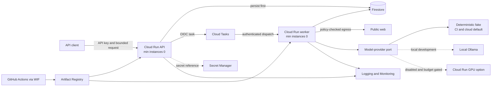
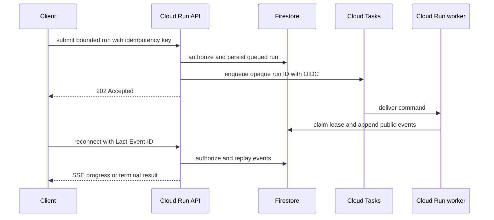
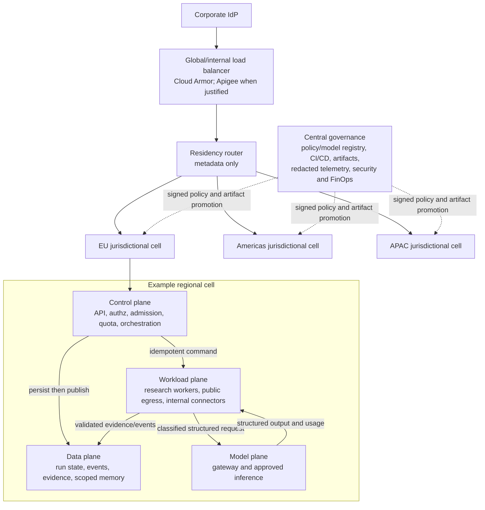

# C01: Cloud decision and target architecture

Status: accepted design; implementation evidence is intentionally deferred to the
delivery gates named in [Boundaries and next evidence](#boundaries-and-next-evidence).

## Decision at a glance

GCP is selected for the executable assessment cell and proposed as the enterprise
target, conditional on company discovery. The decision optimizes for one tested,
low-cost slice while preserving application-owned run, tenant, queue, memory, and
model-gateway contracts. It does not claim that GCP is universally superior.

| Profile | Purpose | Runtime and data boundary | Cost posture | Evidence in C01 |
|---|---|---|---|---|
| Assessment cell | Prove packaging, async execution, identity, persistence, rollback, and teardown | One GCP region; Cloud Run, Cloud Tasks, Firestore, Secret Manager, Artifact Registry, WIF | CPU services scale to zero; one replica per service; one concurrent dispatch; no GPU; EUR 5 alert budget | Architecture and decision only; C02-C07 provide executable evidence |
| Siemens-wide target | Define the production path for thousands of employees across legal regions | Independent jurisdictional cells; corporate identity; governed edge; regional workload, data, and model planes | Capacity and commitments follow measured SLO and unit economics, not a guessed fleet | Target design only; no claim that Apigee, Spanner, GKE, Vertex AI, or multi-cell routing was deployed |

The concise decision record is [ADR-0001](adr/0001-gcp-reference-profiles.md).

## Weighted provider decision

Scores are hypotheses from 1 (poor fit) to 5 (strong fit). The weighted result is
`sum(weight * score)`. It is not a procurement result; platform, identity, security,
legal, regional-availability, and commercial owners must repeat the exercise with
verified requirements.

| Criterion | Weight | GCP | Azure | AWS | Evidence question |
|---|---:|---:|---:|---:|---|
| Security, sovereignty, and landing-zone controls | 20% | 4.6 | 4.7 | 4.6 | Can required regions, perimeters, keys, audit, and policies be enforced? |
| Managed and customer-controlled model platform | 20% | 4.8 | 4.5 | 4.6 | Can managed and self-hosted inference share one governed gateway? |
| Transactional, event, and data platform | 15% | 4.8 | 4.4 | 4.6 | Can state, events, analytics, and regional cells scale predictably? |
| Corporate identity and hybrid integration | 15% | 4.2 | 5.0 | 4.3 | Does the provider fit the actual IdP, network, M365/SAP, and endpoint estate? |
| API management and edge protection | 10% | 4.6 | 4.7 | 4.6 | Are quotas, WAF/DDoS, analytics, and internal/external routes supported? |
| Container portability and operations | 10% | 4.7 | 4.5 | 4.6 | Can workloads move between serverless, Kubernetes, and on-premises placements? |
| Pilot-to-production cost path | 5% | 4.5 | 4.3 | 4.2 | Can the pilot remain cheap without creating a dead end? |
| Assignment delivery confidence | 5% | 5.0 | 3.5 | 3.5 | Can the reference slice be implemented and verified within the assignment? |
| **Illustrative weighted result** | **100%** | **4.64** | **4.56** | **4.48** | The narrow spread requires discovery, not provider advocacy |

GCP wins the reference decision because Cloud Run provides the shortest executable
scale-to-zero path, while GKE and Vertex AI provide later placement options without
changing the container or model-gateway contract. Firestore and Cloud Tasks keep the
assessment small; Spanner/AlloyDB and Pub/Sub provide explicit promotion candidates.

The provider-to-service mapping is deliberately adapter based:

| Capability | GCP reference | Azure alternative | AWS alternative | Portable contract |
|---|---|---|---|---|
| HTTP/container compute | Cloud Run | Azure Container Apps | App Runner or ECS/Fargate | OCI image and HTTP health contract |
| Async dispatch/eventing | Cloud Tasks and Pub/Sub | Service Bus and Event Grid | SQS and EventBridge | Idempotent command/event and lease contracts |
| Control state | Firestore, then evaluate Spanner or AlloyDB | Cosmos DB or Azure Database for PostgreSQL | DynamoDB or Aurora | Tenant-scoped repository and transaction boundaries |
| API edge | HTTPS Load Balancer, Cloud Armor, optional Apigee/IAP | Front Door, WAF, API Management | CloudFront, WAF, API Gateway | Audience-bound auth, quotas, and application authorization |
| Model plane | Ollama locally; Cloud Run GPU, GKE, Vertex AI, or on-premises | Azure AI, AKS, or on-premises | Bedrock, EKS, or on-premises | Governed model request/structured-response contract |
| CI identity | Workload Identity Federation | Federated workload identity | GitHub OIDC federation | Short-lived credentials; no service-account keys |

Azure should replace GCP when an existing Azure landing zone, Entra, API Management,
Azure AI, or enterprise agreements dominate. AWS should replace it when a mature AWS
foundation, SQS/EventBridge/DynamoDB, Bedrock, region coverage, or enterprise
agreements dominate. Any provider loses if residency, model terms, identity, or
measured total cost cannot meet the agreed requirements.

## Low-cost assessment cell

The cell has no always-on GPU. Deterministic fake inference makes CI and cloud smoke
tests reproducible; local Ollama is the default path for a real-model development
benchmark. The optional cloud GPU route remains disabled until all of these gates
pass: explicit spend approval and budget, regional quota, model license, data terms,
latency/startup and load evidence, isolation review, and teardown verification.

| Component | Assessment rule | Cost and safety guard | Enterprise evolution |
|---|---|---|---|
| Cloud Run API/worker | Stateless container; separate service identities | Minimum instances zero, explicit maximums, timeouts, concurrency, and request limits | Keep while the SLO and workload fit; move only on measured placement triggers |
| Cloud Tasks | Rate-controlled authenticated HTTP dispatch | Bounded dispatch, retry, age, and queue depth; application idempotency remains authoritative | Retain for destination throttling; use Pub/Sub for high-throughput commands/events |
| Firestore | Durable assessment run/event/idempotency state | Region and retention explicit; no local filesystem authority | Evaluate Spanner for strongly consistent cell/global control state or AlloyDB/PostgreSQL for a regional relational workload |
| Secret Manager | Secret containers and runtime references only | No payloads in source, images, Terraform state, or CI | Keep with per-cell policy, rotation, and CMEK where required |
| Artifact Registry and WIF | Immutable image plus short-lived CI identity | No long-lived service-account key; promotion pins a digest | Promote the same attested artifact through protected environments |
| Logging/Monitoring | Redacted logs, bounded metrics, health/readiness | No prompt, raw evidence, API key, or personal data in labels | Add immutable sinks, SIEM, traces, SLO/error-budget and cost-per-run views |

The request path remains asynchronous and replay safe:

Acknowledgement must follow durable persistence. Queue delivery is treated as at
least once, so idempotency, leases, cancellation, and terminal-state transitions
stay application owned. SSE is a convenience view over durable events, never the
execution or durability mechanism.

## Siemens-wide enterprise target

These Mermaid diagrams are C4-style container/plane views; the assessment sequence
documents the principal runtime interaction. For the enterprise edge, use Apigee
when API-product lifecycle, cross-team policy, onboarding, and analytics justify its
cost. A load balancer plus Cloud Armor is the smaller API path. IAP is reserved for
internal browser/admin surfaces where an identity proxy fits. If Cloud Armor fronts
a serverless NEG, the default Cloud Run URL cannot remain a bypass route.

Each jurisdictional cell owns prompts, evidence, run state, and memory for its
allowed users and data residency rules. The global plane may keep routing/policy
metadata and permitted aggregate telemetry; it must not become a global copy of user
content. Routing fails
closed when residency or entitlement cannot be evaluated.

| Plane | Responsibilities | Placement and boundary |
|---|---|---|
| Control | Corporate token validation, tenant/resource authorization, admission, quotas, durable accept, orchestration, policy decisions | Cloud Run initially; audience-bound service identity; no model output can alter authorization or policy |
| Workload | Research execution, bounded fetch, extraction, internal connectors | Regional workers; public-web egress is isolated from corporate and OT networks; internal retrieval is a separate ACL-aware tool |
| Data | Transactional run/idempotency/quota state, events, evidence objects, episodic/semantic memory, redacted analytics | Cell-local by classification/residency; Spanner is the primary enterprise evaluation, AlloyDB/PostgreSQL the regional alternative; memory remains tenant scoped, evidence linked, expirable, and deletable |
| Model | Stable gateway, classification and routing policy, approved inference backends, usage and quality telemetry | Cell-local enforcement; prompt bodies are not logged; central governance promotes approved model/prompt/policy versions, not user data |

Memory remains application managed: episodic records come from observed run events;
semantic facts require tenant, evidence, confidence, expiry, conflict, and deletion
gates; procedural playbooks are human-reviewed, signed, versioned artifacts and are
never agent-writable runtime memory.

Cloud Tasks stays useful for scheduled callbacks and per-destination throttling.
Pub/Sub becomes the high-throughput command/event backbone, with transactional
outbox/change-stream integration where supported. Delivery is still treated as at
least once, ordering is partitioned by run ID, and dead-letter queues are quarantine
inputs rather than infinite retry loops.

### Runtime and model placement

| Workload | Default placement | Promotion or exception trigger |
|---|---|---|
| Stateless API, status, SSE, lightweight orchestration | Cloud Run service | Move only for a proven Kubernetes/network/sidecar requirement |
| Finite batch or scheduled work | Cloud Run job | Move for long-running consumption or specialized scheduling |
| Continuous pull consumer | Cloud Run worker pool with explicit autoscaling, or Pub/Sub push/Eventarc to a service | Prefer GKE Autopilot when queue-aware scaling, isolation, service mesh, or warm capacity is required |
| Variable single-GPU inference | Cloud Run GPU behind the model gateway | Enable only after budget/quota/load/security gates; move when sustained or multi-GPU demand justifies it |
| Sustained workers or open-model serving | GKE Autopilot | Use GKE Standard only for unsupported node, privilege, accelerator-topology, or runtime controls |
| Approved managed inference | Vertex AI behind the model gateway | Use only where region, data terms, model quality, latency, and economics are approved |
| Restricted data or existing GPU estate | On-premises/edge endpoint through private connectivity | Requires the same gateway policy, identity, telemetry, and fallback contract |
| VM-bound appliance or legacy runtime | Compute Engine by exception | Requires a separate ADR proving Cloud Run, GKE, and Vertex AI cannot satisfy the OS/kernel/driver/hardware need |

The gateway is a regional policy enforcement point, not a thin SDK wrapper. It
routes by task, tenant, classification, jurisdiction, license, quality, latency,
context, and cost; enforces size/concurrency/token/model limits; returns structured
output and usage; supports canary/rollback; and degrades only to an approved smaller
model, evidence-only response, deferred work, or explicit failure.

## Requirements-to-component map

| Requirement | Assessment component | Enterprise control | Verification owner |
|---|---|---|---|
| Cheap idle state and bounded spend | Cloud Run scale-to-zero, Cloud Tasks caps, Firestore, no GPU | Admission, per-business-unit quotas, max replicas/concurrency, cost-per-successful-run | C03-C07 IaC and cost checks |
| User and workload identity | API key at assignment boundary; per-service identities; WIF for CI | Corporate OIDC/SAML, resource/action/tenant authorization, one workload identity per deployable | C03 identity and later enterprise discovery |
| Durable async execution | Persisted run before Cloud Tasks dispatch | Transactional state/outbox, Pub/Sub, idempotent consumers, Cloud Tasks for throttled destinations | Task 2 ports plus C05 adapters |
| Data residency and deletion | One explicit assessment region and retention | Cell-local state/evidence/memory; metadata-only global router; legal hold and deletion policy | C01A governance and data-owner review |
| Public web and internal knowledge | Public-web-only assessment worker | Separate public egress and ACL-aware internal connector planes; no path to OT networks | Threat model and production security review |
| Model choice and cost | Fake for CI/cloud smoke; local Ollama benchmark; GPU off | Regional governed gateway to Cloud Run GPU, GKE, Vertex AI, or on-premises backend | Task 1 model eval, C01B load evidence, C01A governance |
| Reliability | Idempotency, leases, cancellation, durable public events, health/readiness | Independent cells, bulkheads, degradation ladder, tested backup/restore and failover | C01A SLO/DR plan and operational tests |
| Supply chain and promotion | Locked image, Artifact Registry, WIF | SBOM/provenance, policy scans, protected promotion, Binary Authorization where required, immutable rollback | C02 container and C03-C07 CI/IaC |

## Operational, security, and cost limits

- Initial discussion targets are 99.95% pilot and 99.99% enterprise availability
  for submission/status, plus p95 regional submission below 300 ms excluding IdP
  latency. They are not commitments until business impact and load evidence exist.
- Accepted runs must not be lost. Queue-start and end-to-end completion are separate
  measures; public sites and model backends require class-specific objectives.
- RTO/RPO, retention, legal hold, and active-active versus active-passive are set per
  residency cell after business impact analysis. No multi-region SLA substitutes for
  restore and evacuation tests.
- Every async boundary has bounded retries with jitter, idempotency, cancellation,
  dead-letter quarantine, and operator replay. Admission reduction precedes an
  uncontrolled billing or retry incident.
- Service identities are separate and least privilege; CI uses short-lived WIF;
  organization policy prevents key creation, public resources, primitive roles, and
  disallowed regions. VPC Service Controls and CMEK apply where the data policy
  requires them.
- Public web content, model output, request data, and memory are untrusted. Public
  egress has URL/IP/redirect validation and no route to internal or OT networks.
- Logs, metrics, traces, and cost dimensions contain opaque identifiers and redacted
  metadata, not credentials, prompts, raw pages, evidence bodies, or personal data.
- Budgets are delayed alerts, not hard limits. Edge/API/queue/worker/model/destination
  quotas and maximum scaling are the spend controls. Unit economics are measured as
  cost per successful, quality-acceptable run.
- Immutable image, model, prompt, and policy versions move through dev, nonprod,
  load/security, canary, then cell-by-cell production. Rollback changes traffic or
  version selection; it does not rewrite Git history.

## Boundaries and next evidence

C01 intentionally does not create cloud resources or claim production capacity.

| Follow-on | Evidence still required |
|---|---|
| C02 | Multi-architecture non-root/read-only container, health/signal behavior, SBOM, vulnerability and secret scans |
| C03-C07 | Bootstrap, WIF/IAM, Terraform names, assessment services, budgets, static policies, CI/CD, rollback, teardown, and optional under-budget smoke |
| C01A | Pilot-to-global migration, SLO/RTO/RPO negotiation, tenant/residency matrix, IAM audit, DR/game days, FinOps worksheet, and enterprise approval gates |
| C01B | [Local proof shipped](capacity-model.md): fixed fake-provider envelopes and measurements for submit/status/SSE/cancel, backpressure, idempotency, model-quota degradation, recovery, queue age, latency, and resource use; 100 runs/s with 5,000-15,000 in-flight remains an unmeasured design stress case |

Apigee, Spanner, AlloyDB, GKE, Vertex AI, Cloud Run GPU, multi-cell routing, corporate
IdP integration, VPC Service Controls, and enterprise SIEM integration are target
recommendations, not deployed or tested C01 artifacts. Exact capacity, provider
contracts, regions, residency rules, retention, RTO/RPO, and model licenses remain
enterprise discovery inputs.

The explicit production review question is: **Would this still work if thousands of
employees used it across regional legal boundaries?** C01 answers structurally with
cell isolation, bounded admission, identity, and regional data/model enforcement;
C01A/B must supply the operating and measured evidence.

## Official references

- [Cloud Run resource model, scaling, scale-to-zero, and traffic rollback](https://cloud.google.com/run/docs/overview/what-is-cloud-run)
- [Cloud Run GPU support](https://cloud.google.com/run/docs/configuring/services/gpu)
- [Cloud Run GPU scaling guidance](https://cloud.google.com/run/docs/configuring/services/gpu-best-practices)
- [Cloud Tasks queue rate, retry, and concurrency configuration](https://cloud.google.com/tasks/docs/configuring-queues)
- [GKE Autopilot and Standard selection](https://cloud.google.com/kubernetes-engine/docs/concepts/choose-cluster-mode)
- [Vertex AI endpoint deployment API sample](https://docs.cloud.google.com/vertex-ai/docs/samples/aiplatform-deploy-model-sample)
- [Spanner instance configurations](https://cloud.google.com/spanner/docs/instance-configurations)
- [Cloud Armor integration and serverless-origin bypass warning](https://cloud.google.com/armor/docs/integrating-cloud-armor)
- [VPC Service Controls](https://cloud.google.com/vpc-service-controls/docs/overview)
- [Workload Identity Federation for deployment pipelines](https://cloud.google.com/iam/docs/workload-identity-federation-with-deployment-pipelines)
- [Google Cloud enterprise foundations blueprint](https://cloud.google.com/architecture/blueprints/security-foundations)
- [Microsoft API Management AI gateway reference](https://learn.microsoft.com/ai/playbook/solutions/generative-ai/genai-gateway/reference-architectures/apim-based)
- [AWS Generative AI Lens](https://docs.aws.amazon.com/wellarchitected/latest/generative-ai-lens/generative-ai-lens.html)
